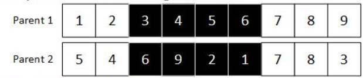
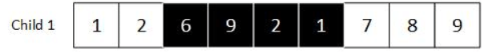
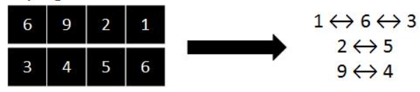
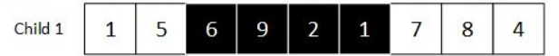

## Introducción
En este apunte se pretende explicar el tipo de crossover que vamos a utilizar en nuestro trabajo práctico integrador denominado Partial Mapped Crossover.

### ¿Qué es Partially mapped crossover?
Es una técnica de crossover usada en algoritmos genéticos para resolver efectivamente problemas basados en permutación. Una característica de este método es que garantiza un intercambio significativo manteniendo la unicidad (o singularidad) de cada elemento.

### Paso 1: Seleccionar el rango del crossover (de forma random)

Observación: Una vez determinado el rango en el que vamos a realizar los cortes, seleccionamos los segmentos de genes que se van a intercambiar, en este caso, realizamos un corte en i = 2 y i = 5, para seleccionar los genes que se encuentran dentro de los cortes realizados.

### Paso 2: Crear al hijo mediante el intercambio de información genética entre los padres

Observación:  
1. Intercambiamos el segmento de genes del padre1 con el del padre2.  
2. Dentro del cromosoma hijo1 hay elementos que se repiten, la forma de trabajar con esto se encuentra en el paso 3.

### Paso 3: Determinar la ruta de relaciones para terminar de definir al hijo

Observación: La "ruta" o "mappeo" consta de establecer una relación basada en los segmentos cortados.

### Paso 4: Terminar de definir al hijo con el mappeo realizado en el paso 3

Observación: Se aplica el mappeo para asegurar que cada uno de los elementos pertenecientes al hijo sea único.
